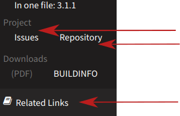

.. include:: Includes.txt
.. highlight:: rst

.. _basic-principles:

================
Basic Principles
================

Introduction to TYPO3 Documentation
===================================

For an excellent introduction, please see the 3 part series on Marcus
Schwemer's blog TYPO3 Worx:

* `GUIDE TO TYPO3 DOCUMENTATION – PART 1: THE USER-INTERFACE <https://typo3worx.eu/2017/01/guide-to-typo3-documentation-part-1-the-ui/>`__
* `GUIDE TO TYPO3 DOCUMENTATION – PART 2: CONTENT STRUCTURE <https://typo3worx.eu/2017/01/guide-to-typo3-documentation-content-structure/>`__

.. important::

   Please note that the section "CONVERT REST TO “READABLE” FORMATS" in part 3 is
   slightly outdated. Currently, using the Docker container for :ref:`rendering
   <rendering-docs>` is the recommended approach. If you edit on GitHub directly,
   GitHub preview should be sufficient for making small changes.

.. _whats-typo3-documentation:

What's TYPO3 Documentation?
===========================

TYPO3 documentation may be one of the following:

* It can be one of the `official manuals <https://docs.typo3.org/>`__
  like :ref:`t3coreapi:start`.
* It can be the documentation of a
  `system extension <https://docs.typo3.org/typo3cms/SystemExtensions/Index.html>`__.
* It can be the documentation of a
  `third party extension <https://docs.typo3.org/typo3cms/extensions/Index.html>`__.
* TYPO3 documentation can also be a
  `Changelog <https://docs.typo3.org/typo3cms/extensions/core/latest/>`__
  entry for the core, for example a documented breaking change or new feature.

.. _common-characteristics-typo3-docs:

Common Characteristics of TYPO3 Documentation
=============================================

All of these examples have a few things in common:

* The documentation is rendered and found on https://docs.typo3.org
* The documentation has a **common theme**, all pages look similar and use the same styles
* Most of the documentation can be directly **edited by the community**. For third party
  extensions, this depends on where and how the source-code is hosted and maintained.
* The source of the documentation is written (mostly) in reStructuredText (**reST**)
* All documentation is rendered using the **same rendering toolchain**. All documentation
  can be rendered locally, with the officially supported Docker image.
* The documentation source files adhere to :ref:`general-conventions` and
  share a **common structure** (e.g. all documentation files in a
  :file:`Documentation` subdirectory).
* Due to the conventions, the rendering of documentation can be automated and
  every documentation project only requires a minimum of setup.

.. _whats-rendering:

What's "Rendering"?
===================

Rendering means (in this specific case) converting the reST
format (.rst files) into its final, readable form, which you can view in your
browser, like this page, which you are probably reading online. If not, load
https://docs.typo3.org/typo3cms/HowToDocument/BasicPrinciples.html in your browser.

In comparison, this is what the original source file looks like:
https://docs.typo3.org/typo3cms/HowToDocument/_sources/BasicPrinciples.txt

Technically, this means converting the reST (.rst files) into HTML, automatically
creating the menu, using the current theme to add additional styles and images.

Documentation Types
===================

Manual
------

A "manual" in the context of TYPO3 documentation is being used to talk about
one unit of documentation, which usually has it's own git repository (or is
included in the git repository of an extension) and consists of one :file:`Documentation`
folder. A "manual" can be a tutorial, such as the :ref:`t3start:start`, a guide,
an extension manual or something else.

Tutorial
~~~~~~~~

A tutorial is a manual. 

Tutorials are designed to be step-by-step instructions specifically created to walk a
beginner through a particular task from beginning to end. To facilitate effective
learning, tutorials provide examples to illustrate the subjects they cover.

In addition, tutorials provide guidance on how to avoid common pitfalls and highlight
key concepts that should be remembered for future reference.

Guide
~~~~~

A guide is a manual.

Guides are designed to familiarize a reader with a specific topic in order to provide a
working knowledge of that particular process. Readers should peruse the guide from cover
to cover in order to gain a practical overview of the process. Once completed, the Guide
becomes a practical reference tool to which a reader can refer as needed. Guides offer
advice on how best to achieve a given task.

Extension Manual
~~~~~~~~~~~~~~~~

An extension manual covers only the extension. This documentation is (usually) included
in the source code of an extension in a :file:`Documentation` subdirectory.

.. _overview-of-types:

Documentation Contribution Matrix
=================================

Considering how to contribute, the things that differ for various kinds of documentation
are:

* Where the issues are maintained (e.g. on Forge or GitHub)
* Where the source code (Git repository) is kept
* The workflow for making changes to the documentation

.. t3-field-list-table::
 :header-rows: 1

 - :Type:         Type of documentation
   :Issues:       Issues
   :Source:       Source Code (Git repository)
   :Workflow:     Workflow for making changes

 - :Type:         Official `guides, tutorials <https://docs.typo3.org/typo3cms/GuidesAndTutorials/Index.html>`__,
                  `core docs <https://docs.typo3.org/typo3cms/References/Index.html>`__,
                  etc.
   :Issues:       On page of rendered docs, click on *Related links > Issues*
   :Source:       On page of rendered docs, click on *Related Links > Repository*, or click on *Edit me on GitHub*
   :Workflow:     Create GitHub pull request, see :ref:`docs-contribute`.

 - :Type:         `TYPO3 Core Changelog <https://docs.typo3.org/typo3cms/extensions/core/latest/>`__
   :Issues:       Core issues: https://forge.typo3.org/projects/typo3cms-core/issues
   :Source:       TYPO3 source code: `git.typo3.org <git://git.typo3.org/Packages/TYPO3.CMS>`__, mirror:
                  `GitHub <https://github.com/TYPO3/TYPO3.CMS>`__
   :Workflow:     see :ref:`Contribution Guide: Add documentation <t3contribute:Adding-documentation>`

 - :Type:         `System extensions <https://docs.typo3.org/typo3cms/SystemExtensions/Index.html>`__
   :Issues:       Core issues: https://forge.typo3.org/projects/typo3cms-core/issues
   :Source:       Same as for Changelog, inside TYPO3 source code: `git.typo3.org <git://git.typo3.org/Packages/TYPO3.CMS>`__,
                  `GitHub <https://github.com/TYPO3/TYPO3.CMS>`__ as mirror
   :Workflow:     see :ref:`Contribution Guide: Add documentation <t3contribute:Adding-documentation>`

 - :Type:         `3rdparty extensions <https://docs.typo3.org/typo3cms/extensions/Index.html>`__
   :Issues:       On page of rendered docs, click on *Related Links > Issues*
   :Source:       On page of rendered docs, click on *Related Links > Repository*, see :ref:`contribute-to-3rdparty-extension`
   :Workflow:     It depends, see :ref:`contribute-to-3rdparty-extension`

To get to the issues or repository of the documentation: On the page of the rendered
manual, click on "Related Links" and then click on "Issues" or "Repository".

Official TYPO3 Manuals
----------------------

The official TYPO3 manuals are hosted on GitHub. Editing the documentation
requires a GitHub account and involves creating a pull request on GitHub.

Find out more about how to contribute: :ref:`docs-contribute`.

Documentation for the Core
--------------------------

The documentation for the core (changelog and system extensions) is added
to the TYPO3 source code. For this reason, the workflow of changing
something in the core documentation is very similar to adding a patch
to the core.

Find out more about the :ref:`core contribution workflow <t3contribute:Start>`
in general or about :ref:`t3contribute:Adding-documentation` in the Contribution
Guide.

Documentation for 3rdparty Extensions
-------------------------------------

The documentation for a 3rdparty extension is maintained within the
source-code of this extensions. If and where it is edited depends
on where the extension is hosted and maintained.

To find out how to contribute documentation for a specific extension:
:ref:`contribute-to-3rdparty-extension`

What about the Wiki?
--------------------

In this manual, we are focusing on TYPO3 documentation in reST / sphinx
that can be found on docs.typo3.org.

The TYPO3 Wiki on https://wiki.typo3.org does contain documentation as well,
but that is not the scope of this manual. In any case, most of the information
from the Wiki is being moved from the Wiki to some manual on docs.typo3.org.

.. _about-typo3-extensions:

About TYPO3 Extensions
======================

In TYPO3, basically everything is an extension. There are system extensions
and third party extensions:

System Extensions
-----------------

System extensions (or core extensions) are extensions that are maintained
in the TYPO3 source. For a list of system extensions, look in the Extension
Manager or in the TYPO3 source, e.g. `GitHub: TYPO3.CMS: /typo3/sysext
<https://github.com/TYPO3/TYPO3.CMS/tree/master/typo3/sysext>`__.

Examples for system extensions are:

* `ext:form <https://docs.typo3.org/typo3cms/extensions/form/>`__
* `ext:fluid_styled_content <https://docs.typo3.org/typo3cms/extensions/fluid_styled_content/>`__
* `ext:rte_ckeditor <https://docs.typo3.org/typo3cms/extensions/rte_ckeditor/>`__

Note, that if your system has been installed with Composer, not all system extensions may exist
in the system, if each system extension has been required separately as "subtree splitted packages"
(not as `typo3/cms`). Since TYPO3 9, installation of "subtree splitted packages" is mandatory.

For more information on subtree split, see

* `Usetypo3: The TYPO3 Subtree Split and Composer <https://usetypo3.com/typo3-subtree-split-and-composer.html>`__
* :ref:`Installation and Upgrade guide: Composer migration <composer-migration-require-subtree-packages>`

System Extension Documentation
~~~~~~~~~~~~~~~~~~~~~~~~~~~~~~

Find the documentation for a system extension on
`System extensions <https://docs.typo3.org/typo3cms/SystemExtensions/Index.html>`__.

Not all system extensions have documentation at the moment.

For more information about contributing to system extensions, see :ref:`contribute-to-system-extension`
in this guide.

See also :ref:`overview-of-types` for an overview of the issues, source and workflow for various
kinds of documentation, including system extensions.

Third Party Extensions
----------------------

Third party extensions are extension that can be created by anyone. They are not included in the TYPO3 core
codebase and are not officially supported by the TYPO3 core team.

Often, but not necessarily, these extensions are hosted on GitHub.

They can be installed by the TYPO3 Extension Manager or via Composer.

Third Party Extension Documentation
~~~~~~~~~~~~~~~~~~~~~~~~~~~~~~~~~~~

Find the documentation on `Extensions by extension key <https://docs.typo3.org/typo3cms/extensions/Index.html>`__.

For more information about contributing to third party extension documentation or for your own extension, see
:ref:`contribute-to-3rdparty-extension`. See :ref:`how-to-start-documentation-for-ext` for
information about starting extension documentation from scratch.

See also :ref:`overview-of-types` for an overview of the issues, source and workflow for various
kinds of documentation, including third party extensions.
