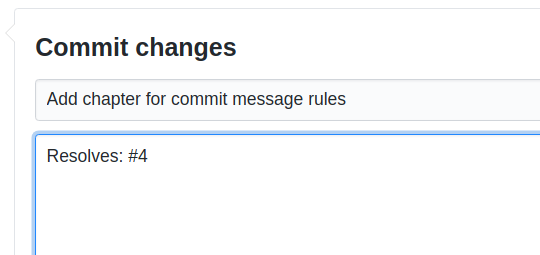

.. include:: ../Includes.txt
.. highlight:: rst

.. _general-conventions-commit-messages:

===============
Commit Messages
===============

The Documentation Team currently does not have strict "rules" for commit messages. These
are recommendations.

Commit Message Recommendations
==============================

* Write commit messages that are **clear**, **concise** and **meaningful**
* Use imperative form: "Fix typo" (instead of "Fixed typo"). This is
  seen from the person, that is going to apply your patch: What will the patch do?
  Fix typo!
* As in the TYPO3 core commit message rules, try to keep first line below 52 characters
  if possible, but below 80 in any case.
* A commit message for the docs should consists of a subject line (first line).
  More lines (seperated by first line with an empty new line) are optional.

Issues
------
  
If an issue exists, link to it, by using for example "Resolves: #issue number", e.g.::

  Resolves: #4

"Resolves" will automatically close the issue, using "Related" will not.

You can also cross link to issues in other repositories in TYPO3-Documentation::
   
   Related: TYPO3-Documentation/T3DocTeam#121

.. seealso::

   * Stack Overflow: `Link to the issue number on GitHub within a commit message <https://stackoverflow.com/questions/1687262/link-to-the-issue-number-on-github-within-a-commit-message>`__

Releases
--------

If it should be backported to an older branch, use `Releases:` (as in :ref:`t3contribute:commitmessage`)::

   Releases: master, 9.5

Examples
========

Example Commit Message With Issue
---------------------------------

.. code-block:: none

   Add chapter for commit message rules

   Resolves: #4

This consists of the following parts:

.. code-block:: none

   <subject>

   Resolves: #<issue number>

The issue number is optional. GitHub will automatically create a link to
the issue.

If you are editing online with GitHub, this may look like this:

Using "Resolves", will automatically close the issue. You can use "Related" instead of
"Resolves" if you do not want the issue to be closed.

You can refer to more than one issue:

.. code-block:: none

   <subject>

   Resolves: #<issue number>
   Resolves: #<issue number>

Add the branches to which the change should be added:

.. code-block:: none

   <subject>

   Resolves: #<issue number>
   Releases: master, 9.5

Using TYPO3 Core Commit Message Rules
=====================================

If you wish, you can use the prefixes [BUGFIX],[FEATURE],[TASK] etc.
as is customary in core development
(see :ref:`t3contribute:commitmessage`).

However, this is not mandatory throughout the docs at the moment. If
possible, use the conventions, that are being used in
the manual in which you are working, e.g. `TYPO3 Explained commits
<https://github.com/TYPO3-Documentation/TYPO3CMS-Reference-CoreApi/commits/master>`__
typically use these conventions.

Additional Information
======================

* `How to write a git commit message <https://chris.beams.io/posts/git-commit/>`__
* :ref:`t3contribute:commitmessage` in TYPO3 Contribution Guide - Core Development

