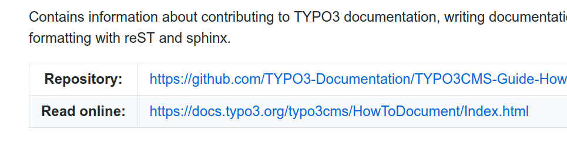

.. include:: /Includes.rst.txt
.. highlight:: rst
.. index::
   ! Files
   Directories

.. _general-conventions-dir-and-filenames:

==========================
Directories and file names
==========================

If the documentation follows these conventions, the documentation rendering toolchain
automatically detects the documentation and renders it correctly on the documentation
server.

For documentation to be rendered, you need at least:

*  (**required**) :ref:`composer-json` in project root. As of May 29, 2019, this is now mandatory!
*  (**required**) a :ref:`"start file" <start-file>`,
   usually :file:`Documentation/Index.rst` or one of the
   :ref:`alternatives <start-file>`, such as :file:`README.rst`.
*  (**required**) :ref:`Documentation/Settings.cfg <settings-cfg>`

.. hint::

   For some example texts, please see :ref:`exampleTexts`.

The other files listed here may not be required, but are recommended.

Further conventions:

*  reStructueredText files have ending **.rst**
*  Markdown files have ending **.md**
*  Included files have ending **.rst.txt**
*  Use **CamelCase** for directories and .rst file names (e.g. :file:`Index.rst`,
   :file:`ExtensionArchitecture.rst`).

Minimal setup ("classic")
=========================

This is the recommended setup. It is used by the official documentation.

.. code-block:: none

   .
   ├── composer.json
   └── Documentation
       ├── Index.rst
       └── Settings.cfg
       └── ...

For alternative start page (e.g. :file:`README.rst` or :file:`README.md`),
see :ref:`"start file" <start-file>`.

.. index:: Files; composer.json
.. _composer-json:

composer.json
=============

*-- required*

The :file:`composer.json` file must be valid and contain TYPO3 CMS as
requirement. In order to validate the :file:`composer.json`, the
following command can be used within the folder containing the file:

.. code-block:: bash

   composer validate

The following two examples demonstrate the minimum content for different
supported TYPO3 versions.

Example for TYPO3 CMS > 8.7.7:

.. code-block:: json

   {
       "name": "vendor/package-key",
       "type": "typo3-cms-extension",
       "description": "An example extension",
       "license": "GPL-2.0-or-later",
       "require": {
           "typo3/cms-core": "^8.7.8"
       },
       "extra": {
           "typo3/cms": {
               "extension-key": "extension_key"
           }
       }
   }

For extensions supporting TYPO3 versions lower then 8.7.7, ``typo3/cms`` is
required as dependency instead of ``typo3/cms-core``:

.. code-block:: json

   {
       "name": "vendor/package-key",
       "type": "typo3-cms-extension",
       "description": "An example extension",
       "license": "GPL-2.0-or-later",
       "require": {
           "typo3/cms": "^7.6"
       },
       "extra": {
           "typo3/cms": {
               "extension-key": "extension_key"
           }
       }
   }

The ``extra`` section can be used to provide an TYPO3 ``extension_key`` for the
package. This will be used when found. If not provided, the ``package-key`` will
be used, where all ``-`` get replaced by ``_``, to follow TYPO3 and packagist
conventions.

.. index::
   Files; Start file
   Files; Documentation/Index.rst
.. _index-rst:
.. _start-file:
.. _supported-filenames-and-formats:

Start file
==========

*-- required*

The recommended start file is :file:`Documentation/Index.rst`. This is what is used for
official manuals.

Use `Index.rst <https://github.com/TYPO3-Documentation/TYPO3CMS-Guide-HowToDocument/blob/master/Documentation/Index.rst>`__
in this manual as an example.

The following is also supported (in this priority):

#. :file:`Documentation/Index.rst`
#. :file:`Documentation/index.rst`
#. :file:`Documentation/Index.md`
#. :file:`Documentation/index.md`
#. :file:`README.rst`
#. :file:`README.md`

If none of these files exist, no documentation will be rendered.

The files ending in .md contain Markdown, the files ending in .rst
contain reStructuredText (reST).

For information about what texts can be on the start page, please
see :ref:`example-start-page`.

.. tip::

   Official manuals often contain both: :file:`README.rst` and :file:`Documentation/Index.rst`.
   Because :file:`Documentation/Index.rst` has higher priority, this will be used as start
   page. The additional README.rst is used as an :ref:`"about file" <about-file>`.

.. warning::

   If you use a single file solution (everything in one file without toctree), there is
   still an open issue concerning the menu. See the
   :ref:`workaround <single-file-workaround>`.

Example - "classic" with toctree
--------------------------------

A similar structure is used by the official documentation.

Files
~~~~~

.. code-block:: none

   .
   ├── ...
   ├── composer.json
   └── Documentation
       ├── Index.rst
       ├── Settings.cfg
       └── Introduction.rst
       └── Configuration.rst

Content
~~~~~~~

Index.rst:

.. code-block:: rst
   :linenos:

   .. include:: /Includes.rst.txt

   =====
   Title
   =====

   some text

   .. toctree::
      :hidden:

      Introduction
      Configuration

*  line 1: every .rst file should include /Includes.rst.txt
*  line 3-5: the header
*  line 10-14: the toctree defines which other pages will be included
   and combined. The menu is generated from all combined files (recursively).
   Here we include the files
   :file:`Introduction.rst`, :file:`Configuration.rst`

Introduction.rst:

.. code-block:: rst

   .. include:: /Includes.rst.txt

   ============
   Introduction
   ============

   some text

   A subsection
   ============

Alternatively, the introduction file may include a toctree as well.

.. _doc-start-file-single-file:

Example - single file
---------------------

This uses an alternative start file :file:`README.rst` on the top level,
instead of :file:`Documentation/Index.rst`.

This may be better suited for extensions.

Files
~~~~~

.. code-block:: none

   .
   ├── ...
   ├── README.rst
   └── Documentation
       ├── Settings.cfg
       └── ...

Content
~~~~~~~

.. code-block:: rst
   :linenos:

   =====
   Title
   =====

   Introduction
   ============

   ... text with introduction ...

   Configuration
   =============

   ... text with configuration ...

*  line 1: every .rst file should include /Includes.rst.txt
*  line 3-5: the title
*  Here, all text is contained in one file.

.. _single-file-workaround:

Workaround for single file
~~~~~~~~~~~~~~~~~~~~~~~~~~

.. warning::

   If you use a single file solution (everything in one file), there is
   still an `open issue concerning the menu <https://github.com/t3docs/docker-render-documentation/issues/64>`__.

   Currently, there is a workaround: Remove the title:

   .. code-block:: rst

      Introduction
      ============

      ... text with introduction ...

      Configuration
      =============

      ... text with configuration ...

.. index:: Files; Settings.cfg

.. _settings-cfg:

Settings.cfg
============

*-- required*

:file:`Documentation/Settings.cfg`

.. important::
   This file must be adapted for the manual.

*  Use  `Settings.cfg
   <https://github.com/TYPO3-Documentation/TYPO3CMS-Guide-HowToDocument/blob/master/Documentation/Settings.cfg>`__
   in this project as an up-to-date example for an official manual!
*  Use the file in `TYPO3CMS-Example-ExtensionManual
   <https://github.com/TYPO3-Documentation/TYPO3CMS-Example-ExtensionManual/blob/master/Documentation/Settings.cfg>`__
   as an up-to-date example for an extension manual!

The file consists of sections, which start with a keyword in brackets, such as `[general]`.
Make sure that all directives exist in the correct section.

.. index::
   Intersphinx mapping
   Settings.cfg; Intersphinx mapping

Intersphinx mapping
-------------------

:file:`Settings.cfg` contains start urls for the :ref:`intersphinx` linking mechanism.

Every manual used for cross referencing must be uncommented in the section `intersphinx_mapping`.

This is an up-to-date list of mappings commonly used:

.. code-block:: none

   [intersphinx_mapping]

   # ----------------
   # official manuals
   # ----------------

   # h2document     = https://docs.typo3.org/m/typo3/docs-how-to-document/master/en-us/
   # t3contribute   = https://docs.typo3.org/m/typo3/guide-contributionworkflow/master/en-us/
   # t3coreapi      = https://docs.typo3.org/m/typo3/reference-coreapi/master/en-us/
   # t3docteam      = https://docs.typo3.org/m/typo3/team-t3docteam/master/en-us/
   # t3editors      = https://docs.typo3.org/m/typo3/tutorial-editors/master/en-us/
   # t3extbase      = https://docs.typo3.org/m/typo3/guide-extbasefluid/master/en-us/
   # t3extbasebook  = https://docs.typo3.org/m/typo3/book-extbasefluid/master/en-us/
   # t3install      = https://docs.typo3.org/m/typo3/guide-installation/master/en-us/
   # t3l10n         = https://docs.typo3.org/m/typo3/guide-frontendlocalization/master/en-us/
   # t3start        = https://docs.typo3.org/m/typo3/tutorial-getting-started/master/en-us/
   # t3sitepackage  = https://docs.typo3.org/m/typo3/tutorial-sitepackage/master/en-us/
   # t3tca          = https://docs.typo3.org/m/typo3/reference-tca/master/en-us/
   # t3templating   = https://docs.typo3.org/m/typo3/tutorial-templating/master/en-us/
   # t3ts45         = https://docs.typo3.org/m/typo3/tutorial-typoscript-in-45-minutes/master/en-us/
   # t3tsconfig     = https://docs.typo3.org/m/typo3/reference-tsconfig/master/en-us/
   # t3tsref        = https://docs.typo3.org/m/typo3/reference-typoscript/master/en-us/
   # t3vhref        = https://docs.typo3.org/other/typo3/view-helper-reference/master/en-us/

   # ----------------
   # system extension
   # ----------------

   # ckedit         = https://docs.typo3.org/c/typo3/cms-rte-ckeditor/master/en-us/
   # core           = https://docs.typo3.org/c/typo3/cms-core/master/en-us/
   # form           = https://docs.typo3.org/c/typo3/cms-form/master/en-us/
   # fsc            = https://docs.typo3.org/c/typo3/cms-fluid-styled-content/master/en-us/
   # sched          = https://docs.typo3.org/c/typo3/cms-scheduler/master/en-us/

.. tip::

   Uncomment **only** the manuals to which you will be linking to in your manual For example, change::

      # t3tsref        = https://docs.typo3.org/m/typo3/reference-typoscript/master/en-us/

   to::

      t3tsref        = https://docs.typo3.org/m/typo3/reference-typoscript/master/en-us/

Example
-------

This is :file:`Settings.cfg` for this manual.

.. literalinclude:: ../Settings.cfg
   :language: cfg

.. index:: Files; Includes.rst.txt
.. _includes-txt:

Includes.rst.txt
================

*-- optional (recommended for official documentation)*

:file:`Documentation/Includes.rst.txt`

This file can be the same for all Documentation projects!

Example:

*  `Includes.rst.txt in this manual 
   <https://github.com/TYPO3-Documentation/TYPO3CMS-Guide-HowToDocument/blob/master/Documentation/Includes.txt>`__

.. literalinclude:: ../Includes.rst.txt
   :language: rst

.. index:: Files; .editorconfig
.. _editorconfig-in-filenames:

.editorconfig
=============

*-- optional (strongly recommended)*

:file:`.editorconfig`

For more information, see :ref:`editorconfig`.

Example:

*  `.editorconfig in this manual <https://github.com/TYPO3-Documentation/TYPO3CMS-Guide-HowToDocument/blob/master/.editorconfig>`__

.. index:: Files; .gitignore
.. _gitignore-in-filenames:

.gitignore
==========

*-- optional (strongly recommended)*

:file:`.gitignore`

All files listed in .gitignore will be ignored by Git. This is useful for generated files,
that should not be added to your repository or for temporary files (e.g. backup files of
your editor).

You can ignore additional files by adding them to your .git/info/exclude file.

The file :file:`.gitignore` will apply to anyone using the repository, :file:`.git/info/exclude` is for yourself
only and will not be included in the repository on GitHub when you push.

Use the file in `this manual: .gitignore
<https://github.com/TYPO3-Documentation/TYPO3CMS-Guide-HowToDocument/blob/master/.gitignore>`__ as a template.

Minimal example
---------------

.. code-block:: none

   # Git global ignore file
   # for local exclude patterns please edit .git/info/exclude
   # Example file see https://github.com/TYPO3-Documentation/TYPO3CMS-Guide-HowToDocument/blob/master/.gitignore

   # ignore generated documentation
   *GENERATED*

.. index:: Files; README.rst
.. _readme-rst:
.. _about-file:

About file (e.g. README.rst)
============================

**optional** (recommended for official TYPO3 documentation)

This file will be displayed on the Git hoster (e.g. GitHub or Gitlab) when someone browses through the
repositories. Use `README.rst <https://github.com/TYPO3-Documentation/TYPO3CMS-Guide-HowToDocument/blob/master/README.rst>`__
from this project as an example! (see `source <https://raw.githubusercontent.com/TYPO3-Documentation/TYPO3CMS-Guide-HowToDocument/master/README.rst>`__).

The link "Read online" will help people to jump directly to the rendered version.

Goal:

*  Provide only basic information and point people to rendered docs
*  Look good on Git hosters such as GitHub

Because of the order of the supported file formats (see :ref:`supported-filenames-and-formats`),
*if* a file such as :file:`Documentation/Index.rst` exists as well as :file:`README.rst`
and has a higher priority, the README.rst is *not* rendered on docs.typo3.org.
The other file with higher priority is rendered on docs.typo3.org but README.rst is rendered on GitHub,
because that is one of the default filenames that GitHub uses to determine what to render.

In the official TYPO3 documentation, we follow this principle:

*  README.rst usually contains 2 links:

   *  to the rendered documentation
   *  to the GitHub repository

.. tip::

   Because of the flexibility of the :ref:`supported file names <supported-filenames-and-formats>`,
   a README.rst may actually be the documentation start page. This is the case, if no other supported
   file with higher priority (such as :file:`Documentation/Index.rst`) exists. Do not do this for official documentation,
   stick to the conventions. You are however free to do this for your **extension documentation.**

.. index:: Files; CONTRIBUTING.rst
.. _contributing-rst:

CONTRIBUTING.rst
================

*-- optional (recommended for official TYPO3 documentation)*

This file serves the purpose of guiding people who come via GitHub towards
our documentation for contributors. As a minimal solution, put a link in there
to :ref:`docs-contribute`.

You can name it :file:`CONTRIBUTING.md` or :file:`CONTRIBUTING.rst`, but as we commonly use reST
here, it is best to stick to :file:`CONTRIBUTING.rst`.

Again, use `CONTRIBUTING.rst <https://github.com/TYPO3-Documentation/TYPO3CMS-Guide-HowToDocument/blob/master/CONTRIBUTING.rst>`__
from this manual as an example.

A link to the file will automatically be displayed by GitHub when someone enters the
"Issues" area (and has not created an issue yet) or when someone creates an issue.
