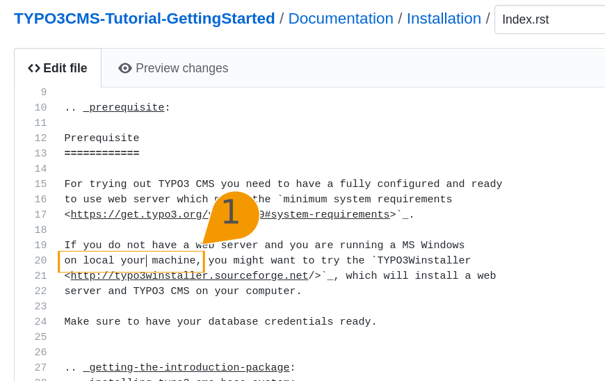
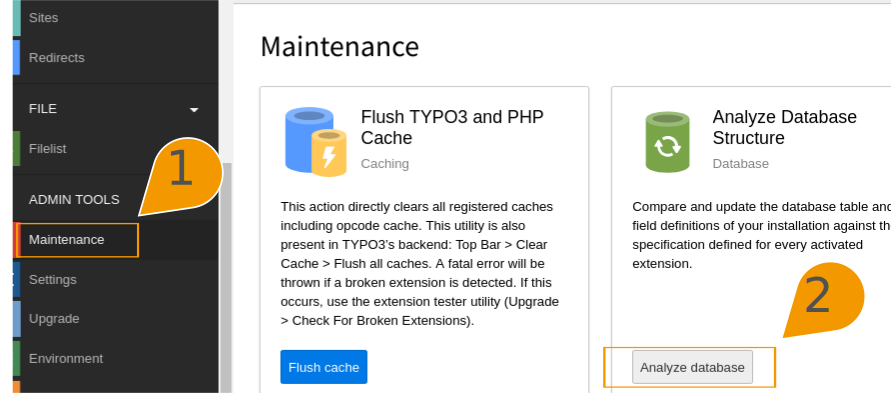

.. include:: ../Includes.txt
.. highlight:: rst

.. _guidelines-for-images:

==============================
Guidelines for Creating Images
==============================

.. important::

   This page is still a work in progress!

When embedding images with reST, it is good practices to add a shadow,
or border as described in :ref:`how-to-document-images` **if**
this improves readability of the page. 

There are various kinds of images used in the documentation. The most
common are:

#. Screenshots
#. Screenshots, augmented with graphic elements, the most common being
   arrows, texts, boxes and numbers to highlight parts of the screenshot,
   add extra explanation etc., with the intention of making the image more
   useful for the reader
#. Diagrams, such as UML diagrams

General Guidelines
==================

* In general, comply with the
  `TYPO3 Web Styleguide <https://styleguide.typo3.org/patternlab/public/index.html>`__

Texts & Fonts
-------------

* When using fonts, please use recommended: **Primary font: "Source Sans Pro", "Helvetica", "Arial",
  sans-serif;**. You can download "Source Sance Pro" as TTF files:
  `Assets <https://styleguide.typo3.org/Data/TYPO3_Assets_2017-08-23.zip>`__,
  path: :file:`00\ -\ Assets/Fonts/SourceCodePro-Regular.ttf`
* If you use text in an SVG, make sure it can be
  displayed on systems that have not installed the used font.
  There are a
  number of ways to do this. If in doubt, ask for :ref:`help <help>` or save the image
  as bitmap (.png). However, if SVG is used, the image can be scaled
  better.
* In any case, you should be safe with using a commonly supported font
  like Helvetica or Arial. Remember, the Web Style Guide proposes
  Source Sans Pro, Helvetica, Arial.

Image Formats
-------------

* It is recommended to use PNG for bitmaps (e.g. screenshots, photographs)
  and SVG for vector graphics images. In any case, you can use .png. 

* If you use png but have combined a screenshot with some graphics elements,
  be sure to additionally upload the file in a format in
  which it can be easily extended (e.g. svg)

Guidelines for Screenshots
==========================

* use PNG format (.png file ending)
* Do not use huge full screen screenshots (except in some cases where it makes sense,
  for example when describing the various parts of the backend). Select a portion
  of a screen that will reflect what you are trying to show. To save yourself hassle,
  use a screenshot tool which can create a screenshot of a portion of a screen.

Here are some :ref:`examples for screenshots <t3contribute:how-to-see-merge-conflicts>`.

.. code-block:: rest

   .. image:: images/github-getting-started-raw.png
      :class: with-shadow
      :scale: 70

How it looks:

   .. image:: images/github-getting-started-raw.png
      :class: with-shadow
      :scale: 70

Another example:

.. image:: images/backend-raw.png
   :class: with-shadow
   :scale: 70

You may however notice, that it might be helpful to point out some relevant part of the
screenshots. That is what we do by creating images as described in the next section.

Guidelines for Screenshots with Graphics Elements
=================================================

Currently, we are working on defining a general color scheme and creating sample
shapes, you can use: https://github.com/TYPO3-Documentation/images

We provide a preliminary version of this, but it is still work in progress and
may change soon.

Here are some example images using the sample shapes:

   This is the text we want to change!

