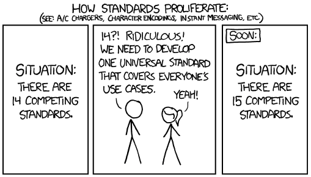

.. include:: ../Includes.txt
.. highlight:: rst

.. _general-conventions:
.. _conventions:

================================
Conventions, CGL, Best Practices
================================

In general, the documentation follows the conventions as described in the
following sections.

But ... please do not get overwhelmed by the vast amount of information and "rules".
You can start writing documentation right away, before having read all this and
learn as you go along! The sections in this chapter are meant to help you in
this task and not make it excruciatingly difficult and tedious! When you
make a change to the official documentation, there is always a maintainer who
will check the changes. He or she may give you some friendly words of advice
if something is not ok.

   The attempt to unify 14 standards will result in 15
   (Source: xkcd https://xkcd.com/927/, Copyright: `CC BY-NC 2.5
   <https://creativecommons.org/licenses/by-nc/2.5/>`__)

.. toctree::
   :hidden:

   ContentStyleGuide
   Glossary
   DirectoryFilenames
   Format
   MenuHierarchy
   CodingGuidelines
   GuidelinesForImages
   CommitMessages
   HowToUpdateDocs
   Licenses
