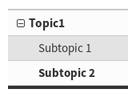

.. include:: /Includes.rst.txt
.. highlight:: rst
.. index::
   Files; Menu hierarchy
   Menu hierarchy
.. _general-conventions-menu-hierarchy:

==============
Menu hierarchy
==============

Technically, the file hierarchy on disc must not affect the menu hierarchy in any way. But, as a general
convention, we use the common practice that the file hierarchy reflects the menu
hierarchy.

Multi-file solution
===================

So, the menu structure  for the files described under
:ref:`general-conventions-dir-and-filenames`

.. code-block:: none

  Documentation/
  |
   --> Index.rst
  |
   --> Topic1/
         |
         -> Index.rst
         -> Subtopic1.rst
         -> Subtopic2.rst

would look something like this:

**Documentation/Index.rst:**

.. code-block:: none

   .. toctree::
      :hidden:

      Topic1/Index

**Documentation/Topic1/Index.rst**

.. code-block:: none

   .. toctree::
      :hidden:

      Subtopic1
      Subtopic2

See :ref:`example-toctree` to see how this is rendered.

Single-file solution
====================

What you can also do, is put everything into one file, for example Index.rst contains:

.. code-block:: rest

   =======
   Chapter
   =======

   Topic 1
   =======

   Subtopic 1
   ----------

   some text

   Subtopic 2
   ----------

   some text

The rendered result will look the same as the multi-file example above, meaning the menu hierarchy
and the rendered headings on the page.

.. tip::

   Whatever variant you choose, it depends what is already common practice in the manual you are
   working on and what is easiest to manage.
