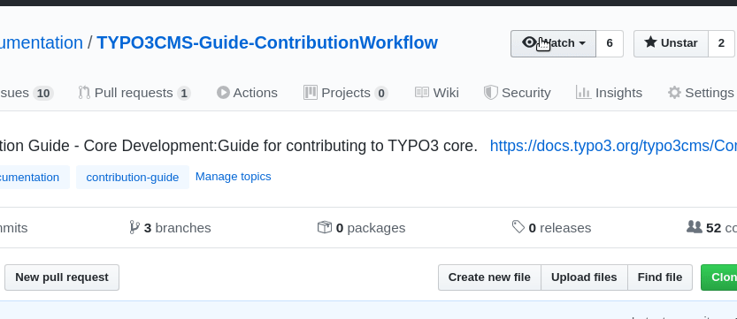

.. include:: /Includes.rst.txt
.. highlight:: rst
.. index:: GitHub
.. _work-with-github:
.. _useful-links:

=======================
How to work with GitHub
=======================

.. tip:: **Looking for help on 'How to edit'?**

   Please head over to page :ref:`docs-contribute-github-method`.

.. index:: GitHub; Repository
.. _github-find-a-repository:

How to find a GitHub repository
===============================

The source for every manual on docs.typo3.org (for example this manual :ref:`start` or
:ref:`t3coreapi:start`) is contained in a GitHub repository.

In the repository, you can find the source files, but also the issues and pull requests.

The repositories of the official manuals are all included in the organization
`TYPO3-Documentation <https://github.com/TYPO3-Documentation>`__.

There, you can browse through the repositories or search for a specific
repository:

.. image:: ../images/github-repo-search.png
   :class: with-shadow

Alternatively, on any rendered page on docs.typo3.org (for example, this page),
you can find the link :guilabel:`Repository` in the footer on the bottom
of the page.

.. index:: GitHub; Notifications
.. _github-get-notifications:

Get notifications from GitHub
=============================

You can get notifications for activity in a repository (e.g. new pull requests or
issues) by **watching** the repository:

#. Find the repository you would like to watch, see :ref:`github-find-a-repository`
   For example, go to the repository for `TYPO3 Explained <https://github.com/TYPO3-Documentation/TYPO3CMS-Reference-CoreApi>`__
#. Click on the **Watch** button on the top of the page

.. index:: GitHub; Issues
.. _links-github-issues:

Find issues
===========

Pick an issue for a topic you are familiar with and try to fix it. Some of the
issues address a problem, some are enhancements where new text needs to be
written.

You can look at the open issues of a manual you are familiar with, pick one
and fix the problem.

For example:

*  `Issues for this guide "Writing Documentation"
   <https://github.com/TYPO3-Documentation/TYPO3CMS-Guide-HowToDocument/issues>`__
*  `Issues for "Getting Started Tutorial"
   <https://github.com/TYPO3-Documentation/TYPO3CMS-Tutorial-GettingStarted/issues>`__

Find issues for a specific manual
---------------------------------

From docs.typo3.org:
   To find the issues for a specific manual click on the link
   :guilabel:`Issues` in the footer on the bottom of the page.

From the repository on GitHub:
   If you have already located the repository on GitHub, you can find the Issues
   by clicking on the :guilabel:`Issues` tab:

   .. image:: ../images/github-issues.png
      :class: with-shadow

From the list of repositories in `TYPO3-Documentation <https://github.com/TYPO3-Documentation>`__:
   Look for the exclamation mark (!) issues icon:

   .. image:: ../images/github-list-issues.png
      :class: with-shadow

.. _github-good-first-issue:
.. _useful-links-for-contributors:

Links to GitHub issues
----------------------

Here are some links to GitHub issues in `TYPO3-Documentation <https://github.com/TYPO3-Documentation>`__.

.. important::

   GitHub will show a 404 page if you are not logged in following these links!
   So, remember to log in first!

For new contributors:

*  `Good first issues <https://github.com/issues?q=is%3Aopen%20is%3Aissue%20label%3A%22good%20first%20issue%22%20archived%3Afalse%20user%3ATYPO3-Documentation>`__ (Link to GitHub)

For contributors:

*  `All open, unassigned issues (without team, theme etc.) <https://github.com/issues?utf8=%E2%9C%93&q=is%3Aopen+is%3Aissue+archived%3Afalse+org%3ATYPO3-Documentation+-repo%3ATYPO3-Documentation%2FT3DocTeam+-repo%3ATYPO3-Documentation%2Ft3SphinxThemeRtd+-repo%3ATYPO3-Documentation%2FTYPO3CMS-Guide-HowToDocument+no%3Aassignee>`__ (Link to GitHub)

For team members and advanced contributors:

*  `All open issues
   <https://github.com/issues?q=is%3Aopen+is%3Aissue+archived%3Afalse+org%3ATYPO3-Documentation>`__ (Link to GitHub)
*  `All open, unassigned issues
   <https://github.com/issues?q=is%3Aopen+is%3Aissue+archived%3Afalse+org%3ATYPO3-Documentation+no%3Aassignee>`__ (Link to GitHub)

The Docker image for rendering is in the organization **t3docs** (instead of TYPO3-Documentation):

*  `All open issues in t3docs <https://github.com/issues?utf8=%E2%9C%93&q=is%3Aopen+is%3Aissue+archived%3Afalse+org%3At3docs>`__ (Link to GitHub)

.. index:: GitHub; Issue solving
.. _github-solve-issue:

Solve an Issue
==============

When you solve an existing issue from GitHub, it is good practice to refer to it in the commit message.

For example, write:

.. code-block:: none

   Resolves: #12

This will automatically close the issue and a link to the issue is displayed in the commit message and
pull request on GitHub.

.. seealso::

   :ref:`general-conventions-commit-messages`

.. index::
   pair: GitHub; Pull requests
   Pull requests
   PR
   see: PR; Pull requests
.. _github-pull-requests:

Find Pull Requests
==================

.. important::

   GitHub will show a 404 page if you are not logged in following these links!
   So, remember to log in first!

Anyone is welcome to review open pull requests!

In **TYPO3-Documentation**:

*  `Open pull requests <https://github.com/pulls?q=is%3Aopen+is%3Apr+archived%3Afalse+org%3ATYPO3-Documentation+sort%3Acreated-desc>`__ (Link to GitHub)

In **t3docs** (Docker image):

*  `Open pull requests <https://github.com/pulls?q=is%3Aopen+is%3Apr+archived%3Afalse+org%3At3docs+sort%3Acreated-asc>`__ (Link to GitHub)

About reviewing pull requests, you can look in the GitHub help pages:

.. seealso::

    *  `About pull request reviews <https://help.github.com/en/articles/about-pull-request-reviews>`__ (GitHub)
    *  `Commenting on a pull request <https://help.github.com/en/articles/commenting-on-a-pull-request>`__ (GitHub)

.. tip::

   If you are reviewing a pull request and want to leave comments, make sure to
   `mark the line <https://help.github.com/en/articles/commenting-on-a-pull-request>`__
   in the PR.

Find Pull Requests That Require My Attention
============================================

When another contributor creates their own pull request, they might ask you to review
their change by assigning you to the pull request as an assignee.

To review all requests that are assigned to you, select Pull requests from the main navigation bar
followed by Review requests.

.. image:: ../images/github-review-requests.png
   :class: with-shadow
