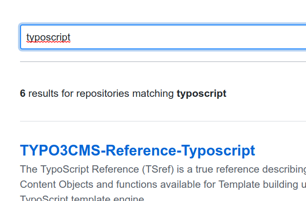
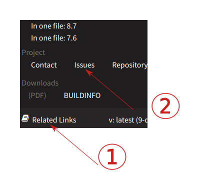

.. include:: ../Includes.txt
.. highlight:: rst

.. _work-with-github:
.. _useful-links:

=======================
How to Work With GitHub
=======================

How to Find a GitHub Repository
===============================

The repositories of the official manuals are all included in the organization
`TYPO3-Documentation <https://github.com/TYPO3-Documentation>`__.

There, you can browse through the repositories or search for a specific
repository:

Additionally, on any rendered page, you can open :guilabel:`"Related Links" > "Repository"`.

.. _links-github-issues:

Issues
======

Pick an issue for a topic you are familiar with and try to fix it. Some of the
issues address a problem, some are enhancements where new text needs to be
written.

Find Issues for a Specific Manual
---------------------------------

You can look at the open issues of a manual you are familiar with, pick one
and fix the problem.

For example:

* `Issues for this guide "Writing Documentation"
  <https://github.com/TYPO3-Documentation/TYPO3CMS-Guide-HowToDocument/issues>`__
* `Issues for "Getting Started Tutorial"
  <https://github.com/TYPO3-Documentation/TYPO3CMS-Tutorial-GettingStarted/issues>`__

To find the issues for a specific manual click on :guilabel:`Related Links` (on the
bottom left of any page of the manual) and then :guilabel:`Issues`.

Some Links to Specific Issues
-----------------------------

In the following sections you will find some links to a list of issues.

.. note::

   GitHub will show a 404 page if you are not logged in following these links!
   So, remember to log in first!

.. _github-good-first-issue:

For New Contributors
~~~~~~~~~~~~~~~~~~~~

* `Good first issues <https://github.com/issues?q=is%3Aopen%20is%3Aissue%20label%3A%22good%20first%20issue%22%20archived%3Afalse%20user%3ATYPO3-Documentation>`__

We added a label "Good first issue" which is used to tag issues that outline
a small task that may be good to get started. But, you are not restricted to
this! Start with any issue that seems to be a good fit for you!

.. _useful-links-for-contributors:

For Contributors
~~~~~~~~~~~~~~~~

* `Open, unassigned issues  <https://github.com/issues?utf8=%E2%9C%93&q=is%3Aopen+is%3Aissue+archived%3Afalse+org%3ATYPO3-Documentation+-repo%3ATYPO3-Documentation%2FT3DocTeam+-repo%3ATYPO3-Documentation%2Ft3SphinxThemeRtd+-repo%3ATYPO3-Documentation%2FTYPO3CMS-Guide-HowToDocument+no%3Aassignee>`__ (without team issues, without t3SphinxThemeRtd, without "Writing Documentation")

This includes all issues for official manuals. We excluded the issues in repositories
that should typically be handled by a Documentation Team member.

Advanced
~~~~~~~~

For Documentation Team members, members of task forces, advanced contributors:

* `All open issues in TYPO3-Documentation
  <https://github.com/issues?q=is%3Aopen+is%3Aissue+archived%3Afalse+org%3ATYPO3-Documentation>`__
* `All open, unassigned issues in TYPO3-Documentation
  <https://github.com/issues?q=is%3Aopen+is%3Aissue+archived%3Afalse+org%3ATYPO3-Documentation+no%3Aassignee>`__

The Docker image for rendering is in the organization **t3docs** (instead of TYPO3-Documentation):

* `All open issues in t3docs <https://github.com/issues?utf8=%E2%9C%93&q=is%3Aopen+is%3Aissue+archived%3Afalse+org%3At3docs>`__

.. _github-new-content:

New Content
-----------

These issues describe missing content that needs to be written:

* `Content missing <https://github.com/issues?utf8=%E2%9C%93&q=is%3Aopen+is%3Aissue+label%3A%22content+missing%22+archived%3Afalse+user%3ATYPO3-Documentation+>`__

.. _github-pull-requests:

Pull Requests
=============

Anyone is welcome to review open pull requests!

In **TYPO3-Documentation**:

* `Open pull requests <https://github.com/pulls?q=is%3Aopen+is%3Apr+archived%3Afalse+org%3ATYPO3-Documentation+sort%3Acreated-desc>`__

In **t3docs** (Docker image):

* `Open pull requests <https://github.com/pulls?q=is%3Aopen+is%3Apr+archived%3Afalse+org%3At3docs+sort%3Acreated-asc>`__

About reviewing pull requests, you can look in the GitHub help pages:

* `About pull request reviews <https://help.github.com/en/articles/about-pull-request-reviews>`__ (GitHub)
* `Commenting on a pull request <https://help.github.com/en/articles/commenting-on-a-pull-request>`__ (GitHub)

.. tip::

   If you are reviewing a pull request and want to leave comments, make sure to
   `mark the line <https://help.github.com/en/articles/commenting-on-a-pull-request>`__
   in the PR.
