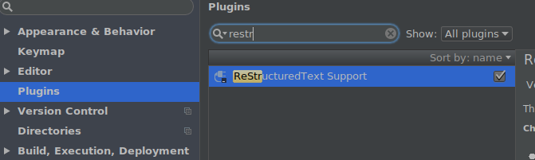
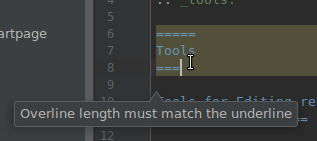
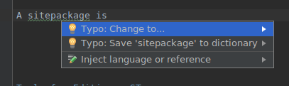

.. include:: ../Includes.txt
.. highlight:: rst

.. _tools:

=====
Tools
=====

.. _tools-for-editing-rest:

Tools for Editing reStructuredText
==================================

When editing reST files locally, you should use an editor or IDE with
good support for syntax highlighting and marking errors in reST.

`PhpStorm <https://www.jetbrains.com/phpstorm/>`__ is commonly used by
developers in the TYPO3 community. It does however cost money.

Good alternatives can be found in the "Free Editors" section of
`StackOverflow: reStructuredText tool support <https://stackoverflow.com/a/2747041/2444812>`__.

PhpStorm
--------

You should activate some plugins that will assist you when editing reST
files. In order to activate a plugin, press :kbd:`ctrl + alt + s`, then
select :guilabel:`Plugins`, search for the plugin and enable it (mark
checkbox).

If the Plugin is not installed yet, you may have to :guilabel:`Browse
repositories`, select the plugin and click the green :guilabel:`Install` button.

reStructuredText Plugin
~~~~~~~~~~~~~~~~~~~~~~~

Enable the `reStructuredText plugin <https://plugins.jetbrains.com/plugin/7124-restructuredtext-support>`__
to get correct syntax highlighting. The plugin will also point out errors,
for example wrong title underline length.

.. _phpstorm-editorconfig:

EditorConfig Plugin
~~~~~~~~~~~~~~~~~~~

Additionally, (download) and enable the `EditorConfig <https://plugins.jetbrains.com/plugin/7294-editorconfig>`__
plugin in order to get correct Coding Guideline settings like indent width already defined in
.editorconfig file of documentation project.

Spellchecking
~~~~~~~~~~~~~

You can add some specific TYPO3 spellings to PhpStorms internal dictionary.
Just place the cursor on the word, click alt-enter and then "Save to dictionary".

For more information, see the `Spellchecking <https://www.jetbrains.com/help/phpstorm/spellchecking.html>`__
PhpStorm page.

