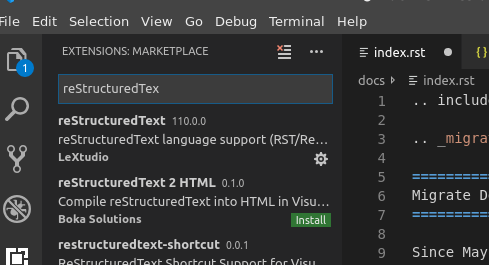

.. include:: /Includes.rst.txt
.. highlight:: rst
.. index:: reST; Editors
.. _tools:
.. _tools-for-editing-rest:

======================
Tools for Editing reST
======================

We will cover some IDEs here, that may be useful if you edit locally
with the :ref:`docs-contribute-git-docker`.

When editing reST files locally, you should use an editor or IDE with
good support for syntax highlighting and marking errors in reST.

*  `PhpStorm <https://www.jetbrains.com/phpstorm/>`__ is commonly used by
   developers in the TYPO3 community. It does however cost money. PhpStorm
   comes with a number of plugins for TYPO3, e.g. for TypoScript and Fluid.
*  **Visual Studio Code** also comes with plugins for TYPO3 and for reStructuredText.
   And it is free.

Other alternatives can be found in the "Free Editors" section of
`StackOverflow: reStructuredText tool support <https://stackoverflow.com/a/2747041/2444812>`__.

The editor or IDE should ideally have the following features:

*  syntax highlighting for reST
*  show syntax errors
*  provide possibility to use (configurable) code snippets for easy insertion of
   directives
*  provide keyboard shortcuts and configurable commands for running
   Docker
*  built in spell checking (English)

Setup your editor / IDE to use the .editorconfig file, which already
exists in most documentation repositories. This will set up your
editor / IDE to comply with our :ref:`basic coding guidelines
<format-rest-cgl>`.

You may have to install
an additional plugin, see `EditorConfig <https://editorconfig.org/#download>`__.

.. index:: reST; Visual Studio Code

Visual Studio Code
==================

restructuredText Plugin
-----------------------

#. Open Extensions (:kbd:`CTRL+SHIFT+X`)
#. Enter *reStructuredText* in search box
#. Select LeXtudio extension
#. Press install

The LeXtudio extension comes with some built in code snippets.

You can:

*  show all snippets by pressing :kbd:`CTRL+Space`
*  start entering the beginning of a snippet name and press tab

.. tip::

   Try this now by typing image and then TAB.

.. image:: ../videos/vscodesnippets.gif
   :class: with-shadow

You can easily extend the snippets by adding **user snippets**:

#. Open :guilabel:`File > Preferences > User Snippets`
#. Enter a name
#. Edit the json file

Here is an example:

.. code-block:: json

   {
      "image (full)": {
         "prefix": "imgf",
         "body": [
            ".. image:: $1",
            "   :class: with-shadow",
            "   :alt: $2",
            "   :target: $3",
            "$4"
         ],
         "description": "image with parameters"
      }
   }

*  You can enter the snippet by typing `imgf`:code: and then TAB
*  The $1, $2 etc. mark the places where further TABs will take you.
   Use this if extra text needs to be entered

.. image:: ../videos/vscodesnippets2.gif
   :class: with-shadow

.. index:: reST; PhpStorm

PhpStorm
========

reStructuredText Plugin
-----------------------

You should activate the `reStructuredText plugin <https://plugins.jetbrains.com/plugin/7124-restructuredtext-support>`__
that will assist you when editing reST
files. In order to activate a plugin, press :kbd:`ctrl + alt + s`, then
select :guilabel:`Plugins`, search for the plugin and enable it (mark
checkbox).

.. image:: ../images/phpstorm-rest-plugin.png
   :class: with-shadow

If the Plugin is not installed yet, you may have to :guilabel:`Browse
repositories`, select the plugin and click the green :guilabel:`Install` button.

Some errors in formatting will be pointed out:

.. image:: ../images/phpstorm-rest-warning.png
   :class: with-shadow

.. _phpstorm-editorconfig:

EditorConfig Plugin
-------------------

Additionally, (download) and enable the `EditorConfig <https://plugins.jetbrains.com/plugin/7294-editorconfig>`__
plugin in order to get correct Coding Guideline settings like indent width already defined in
.editorconfig file of documentation project.

Spellchecking
-------------

You can add some specific TYPO3 spellings to PhpStorms internal dictionary.
Just place the cursor on the word, click alt-enter and then "Save to dictionary".

.. image:: ../images/phpstorm-add-to-dictionary.png
   :class: with-shadow

For more information, see the `Spellchecking <https://www.jetbrains.com/help/phpstorm/spellchecking.html>`__
PhpStorm page.

