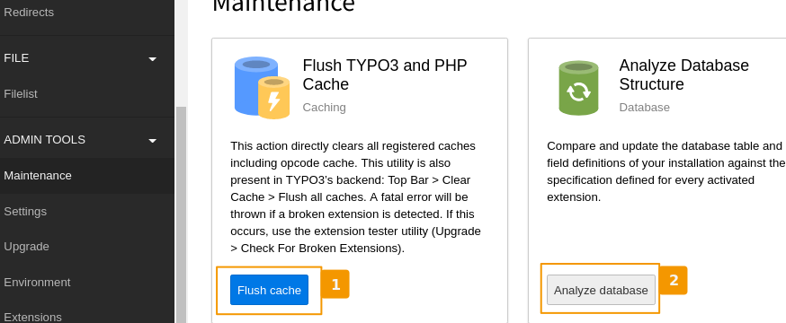

:orphan:

.. editor's note: this page is not included in the menu in the toctree
..                it is linked from the start page

.. include:: Includes.txt

.. _whats-new:

=======================
Whats New in This Guide
=======================

2019
====

.. _news-2019-rest-tables:
.. rst-class:: panel panel-default

NEW: Tables (reST and Sphinx Reference)
---------------------------------------

2019-02-05 by Sybille Peters

See the new page :ref:`rest-tables` describing how to use tables
in reST.

.. _news-2019-rest-cheat-sheet:
.. rst-class:: panel panel-default

NEW: Cheat Sheet for reST and Sphinx
------------------------------------

2019-02-03 by Sybille Peters

See the new :ref:`rest-cheat-sheet` for commonly
used markup on one page.

.. _news-2019-guidelines-for-images:
.. rst-class:: panel panel-default

NEW: Guidelines for Images
--------------------------

2019-01-22 by Sybille Peters

We now have :ref:`guidelines-for-images`. To give the TYPO3 documentation a more consistent look,
we have summarized some general guidelines for images.

Additionally, a number of `icons <https://github.com/TYPO3-Documentation/images>`__
have been supplied by the Design Team, which can be used.

As always, please look at the existing documentation, report problems as `issues
<https://github.com/TYPO3-Documentation/TYPO3CMS-Guide-HowToDocument/issues>`__, make
suggestions or give feedback in the Slack channel (see :ref:`slack`).

.. _news-2019-tools-for-editing-rest:
.. rst-class:: panel panel-default

NEW: Tools Chapter
------------------

2019-01-04 by Sybille Peters

The :ref:`Tools <tools-for-editing-rest>` chapter was added. It contains some tips for
editing reST files with PhpStorm.

2018
====

.. _news-2018-content-styleguide:
.. rst-class:: panel panel-default

NEW: Spelling Guide
-------------------

2018-11-27 by Sybille Peters

A :ref:`spelling-ref` and some hints for :ref:`title capitalization <spelling-title-case>`
and spelling of plaintext were added in order to make it easier to use consistent spelling.

.. _news-2018-more:
.. rst-class:: panel panel-default

More News in 2018
------------------

* Nov 26, 2018 :ref:`docs-contribute-github-method`
* Oct 21, 2018 :ref:`general-conventions-commit-messages`
* July 13, 2018 :ref:`rendering-docs-troubleshooting`
* July 13, 2018 :ref:`basic-principles`
* July 13, 2018 :ref:`general-conventions`
* July 13, 2018 :ref:`rest-common-pitfalls` for help on avoiding common errors when working with reST
* July 23, 2018 :ref:`youtube-videos`
