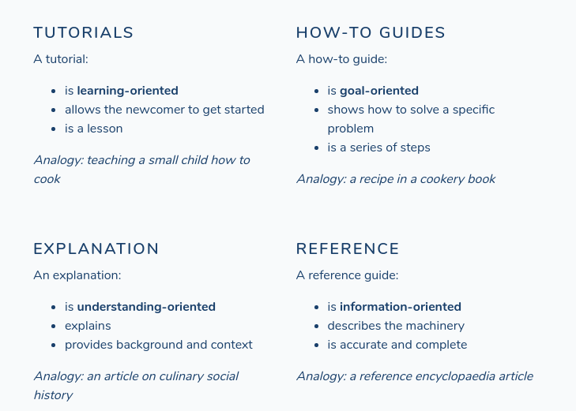

.. include:: ../Includes.txt
.. highlight:: rst

.. _writing-content:

==============================
How to Write Good Content
==============================

* Daniele Procida: `"What nobody tells you about documentation <https://www.divio.com/blog/documentation/>`__
  (May 19, 2017) - A very good blogpost about different kind of manuals.

   Overview of content types, taken from Daniele Procida

.. toctree::
   :hidden:

   WritingContentTips
   Tutorial

.. todo:: Still needs some work
..  Guide

