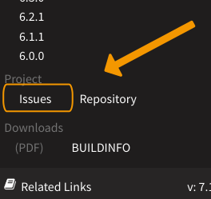

.. include:: ../Includes.txt
.. highlight:: rst

.. _tips-extension-authors:

==========================
Tips for Extension Authors
==========================

.. _tip-ext-new-doc-server:
.. rst-class:: panel panel-default

Webhook and composer.json
=========================

Because of the
`move to the new documentation server <https://typo3.org/article/docstypo3org-gets-new-infrastructure/>`__,
a valid composer.json
and a webhook is now mandatory for extensions, in order to automatically be
rendered on the documentation server.

Read more: :ref:`migrate`

If you see the following on the rendered page of your extension, it has not
yet been rendered with the new mechanism:

.. figure:: ../images/docs_deprecation.png
   :class: with-shadow
   :alt: Deprecation message on rendered extension documentation page

   Deprecation message on rendered extension documentation page

.. _tip-edit-me-on-github:
.. rst-class:: panel panel-default

How to Get an "Edit me on GitHub" Button
========================================

2019-03-17 by Sybille Peters

Why might you want an "Edit me on GitHub" button on the rendered pages
of your extension documentation?

.. figure:: ../images/edit_me_on_github+shadow.svg
   :class: with-shadow
   :alt: "Edit me on GitHub" button

   "Edit me on GitHub" button

It makes it easier to contribute to the documentation!

**How do you enable this?**

Just add this to your :ref:`settings-cfg` and customize it:

.. code-block:: none

   [html_theme_options]

   # to get the "Edit me on Github Button"
   github_branch = master
   github_repository = TYPO3-Console/TYPO3-Console

If you used the `sample extension <https://github.com/TYPO3-Documentation/TYPO3CMS-Example-ExtensionManual>`__
and followed the steps in :ref:`how-to-start-documentation-for-ext`, you should actually already have this.

Look at the `typo3_console <https://docs.typo3.org/typo3cms/extensions/typo3_console/>`__
extension for a working example.

.. _tip-link-to-issues:
.. rst-class:: panel panel-default

How to Link to Your Issues
==========================

2019-03-13 by Sybille Peters

Do you want contributors to find the issues for your extension easily when
reading your extension documentation on docs.typo3.org?

Add `project_issues` to your :ref:`settings-cfg`:

.. code-block:: none

   [html_theme_options]

   project_issues = https://github.com/<user>/<extension-key>/issues

Replace `<user>` and `<extension-key>` with your username and extension key
or replace entire URL with URL to your issues.

A link to the Issues will then be available in the "Related Links" section.

Example extension: `news <https://docs.typo3.org/typo3cms/extensions/news/>`__

.. _tip-extension-rendered-old-layout:
.. rst-class:: panel panel-default

HELP: My extension documentation was rendered with the OLD layout!
==================================================================

2018-02-13 by Martin Bless

That is actually a good sign. Why? Read on!

Shortly after an extension upload to the TER the documentation server will
render the documentation that (hopefully!) comes with that version.
BUT: At the moment this automatic rendering process still uses the old layout.
Unfortunately the current server is very old and can't run the new toolchain.
And we haven't managed to switch everything to a new server yet. That is why
you initially may feel you've done something wrong because that outdated
layout is used.

At the moment I'm running the new toolchain manually "every now and then" from my
local machine. In general that should happen at least once a day. The plan is,
of course, to set up a fully automated process for that. But we can't foresee
at the moment when exactly that will be.

What does this mean? If you see your documentation in the old layout that
actually is a good sign. It proves that the documentation can be found and
rendered. Just stay calm and patient until the new layout appears. That's the
only thing you need to do.

Easy - you can do it!

.. _tip-of-the-day-2016-12-29:
.. rst-class:: panel panel-default

How to start Documentation for Your TYPO3 Extension (With Starter Project)
==========================================================================

**Update:** Please see :ref:`how-to-start-documentation-for-ext`
for an up-to-date description of starting extension documentation from scratch
using the example extension manual and rendering with Docker (2019-01-06).

2016-12-29 by Martin Bless

**Quickstart:**

-  Get yourself one of the T3DocumentationStarter projects that look like
   https://docs.typo3.org/typo3cms/drafts/github/T3DocumentationStarter/Public-Info-000/

-  Read the frontpage of the starter to learn how it works.

-  You may edit directly at Github. Just do a little update and save (=push),
   and some very few minutes later you can reload the page and see what the
   server has rendered for you. You don't have to install or render anything yourself.
   The server will do that for you.

-  Or work with Github as you usually do.

-  To become the owner of a starter project send a mail with your **Github username**
   to the docteam to documentation@typo3.org and ask for a T3DocumentationStarter project.

-  Later: Copy the :file:`./Documentation` folder of the starter project to your extension.
   Write your documentation. Edit the metadata in :file:`./Documentation/Settings.cfg` and
   you are done.

Come to the sunny side of documentation - have fun!
