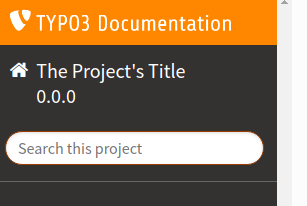
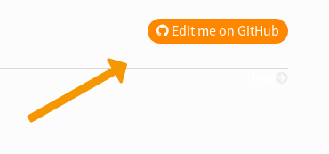

.. include:: /Includes.rst.txt
.. index:: Extension manuals; FAQ
.. _faq-for-extension-authors:
.. _tips-extension-authors:

===
FAQ
===

.. rst-class:: panel panel-default

Where is the link to my documentation in the TYPO3 extension repository?
========================================================

Short answer: it will take a few hours and up to a day until the documentation for new extensions is linked in the details of your extension in the `TYPO3 Extension Repository (TER) <https://extensions.typo3.org>`__.

Long answer: the documentation of all extensions is exposed by an API which is consumed by the TER through a TYPO3 Scheduler task. The TER first needs to pick up updates of extensions which by itself can take some time due to server and browser caches. Furthermore the search in the TER also needs some time to update its index.

Finally the TER will only link to documentation with a matching version, so make sure that there actually is a documentation version for each of your extension version. See :ref:`reregister-versions` to publish documentation for already released versions.

.. rst-class:: panel panel-default

I am missing some documentation for extension versions
======================================================

If you are missing documentation for some extension versions we have a
:ref:`workaround <reregister-versions>` to fix that.

.. rst-class:: panel panel-default

Why Does the Documentation not provide a title?
===============================================

Refer to :ref:`migrate-necessary-steps` in order to fix this issue.

You must add the project title to your :file:`Settings.cfg`:

.. code-block:: rest

    [general]

    # .................................................................................
    # ...   (required) title (displayed in left sidebar (desktop) or top panel (mobile)
    # .................................................................................

    project     = title, for example extension name

    # .................................................................................
    # ...   (recommended) version, displayed next to title (desktop) and in <meta name="book-version"
    # .................................................................................

    release     = 2.0.0

:ref:`settings-cfg` provides detail information.

.. rst-class:: panel panel-default

How do I find my new rendered documentation?
============================================

There are several possibilities:

#. Search for the extension on https://docs.typo3.org/Home/Extensions.html.
#. Or, create URL manually, see :ref:`migrate-url-structure`.
#. Or, if it was just rerendered, the URL will be referenced from https://intercept.typo3.com/admin/docs/deployments.
   The column **Branch** contains the link.

.. rst-class:: panel panel-default

Is it possible to highjack extension documentation?
===================================================

How do you make sure only the author of the extension publishes the documentation?

Documentation rendering is restricted to one repository per package.

I.e. if someone triggers documentation rendering with a repository with vendor *myVendor* and
package *myPackage*, then nobody else will be able to trigger documentation from
a different repository with that exact `vendor/package` name combination. You
could say this works on a first come first served basis.

We have added mechanisms to prevent registering a package from the wrong repository
with malicious intent or accidentally: The first time someone triggers documentation
rendering for a specific `vendor/package` combination, the Documentation Team must
approve of this. This way, misuse is prevented.

See :ref:`webhook` for more information.

.. rst-class:: panel panel-default

Is there a way to manually trigger documentation rendering aside from a Git repository push?
============================================================================================

Yes and no. Regular users do not have this option at the moment. However,
as a member of the Documentation Team you can go to https://intercept.typo3.com
and log in with your typo3.org account. Then in the menu you can navigate to
:guilabel:`Documentation > Deployments`. At the top right hand side you will see a button
:guilabel:`Add Configuration`. By clicking this button and going through the form,
you can add a repository manually without the hook. Nevertheless we strongly
recommend the usage of the webhook.

.. rst-class:: panel panel-default

Is the documentation independent of the TER?
============================================

Yes.

The documentation and the extension at
TER (https://extensions.typo3.org) are two separate, independent entities.

In theory you could have the documentation in GitHub (for example)
and the extension (code) somewhere else (or not in Git at all). You just
need to fire the webhook from GitHub/GitLab/Bitbucket to trigger the
documentation rendering.

.. rst-class:: panel panel-default

Should I add a link to the documentation in TER?
================================================

The documentation link should get updated automatically in TER.

Only use "external documentation" if your documentation is hosted
somewhere else (not on docs.typo3.org).

.. rst-class:: panel panel-default
.. index:: Files; README.rst
.. _faq-can-i-use-a-readmerst-or-readmemd-instead:

Can I use a README.rst (or README.md) instead?
==============================================

GitHub (or Gitlab, bitbucket) etc. automatically render a :file:`README.rst` (or .md)
on the repository homepage.

For TYPO3 documentation I am required to have extra documentation in a :file:`Documentation`
folder. This means I have to maintain 2 documentations. Or not?

**Answer:** No. You have these 2 options:

#. Use a :file:`README.rst` (or .md) **and** a :file:`Documentation/Index.rst` (for example).
   This is done in our official manuals. The :file:`README.rst` is not used as documentation,
   it is used as an :ref:`about the repo file <about-file>`. The README is mostly
   used to direct users who come via GitHub (or Gitlab, Bitbucket etc.) to the rendered
   documentation on docs.typo3.org

#. Or, use :file:`README.rst` (or .md) as main documentation (:ref:`start-file`) and
   put everything in the :file:`README.rst`. The :file:`Documentation/Settings.cfg` file
   must also exist, but that is all that needs to be in the `Documentation`
   directory.

Actually, you have more options, but we do not want to make things too complicated.

Which one should you choose? That is up to you.

We recommend: Use method 1) for extensive documentation with several chapters,
use method 2) for minimal documentation which can be maintained in one file.

.. rst-class:: panel panel-default
.. index:: "Edit on GitHub" button
.. _tip-edit-me-on-github:

How do I get an "Edit on GitHub" button?
========================================

Why might you want an "Edit on GitHub" button on the rendered pages
of your extension documentation?

   "Edit on GitHub" button

It makes it easier to contribute to the documentation!

**How do you enable this?**

Just add this to your :ref:`settings-cfg` and customize it:

.. code-block:: none

   [html_theme_options]

   # to get the "Edit on GitHub Button"
   github_branch = main
   github_repository = TYPO3-Console/TYPO3-Console

If you used the `sample extension <https://github.com/TYPO3-Documentation/TYPO3CMS-Example-ExtensionManual>`__
and followed the steps in :ref:`how-to-start-documentation-for-ext`, you should actually already have this.

Look at the `typo3_console <https://docs.typo3.org/typo3cms/extensions/typo3_console/>`__
extension for a working example.

.. rst-class:: panel panel-default
.. _tip-link-to-issues:

How can I link to my issues?
============================

Do you want contributors to find the issues for your extension easily when
reading your extension documentation on docs.typo3.org?

Add `project_issues` to your :ref:`settings-cfg`:

.. code-block:: none

   [html_theme_options]

   project_issues = https://github.com/<user>/<extension-key>/issues

Replace `<user>` and `<extension-key>` with your username and extension key
or replace entire URL with URL to your issues.

A link to the Issues will then be available footer section.

Example extension: `news <https://docs.typo3.org/typo3cms/extensions/news/>`__

Further Questions?
==================

Get in touch with us, if you have problems, would like to ask questions or make suggestions.

Our `team page <https://typo3.org/community/teams/documentation/#c9886>`__ contains
information about how to contact us.
