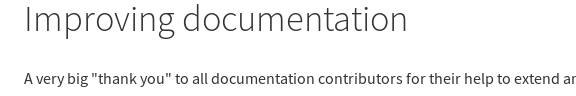

.. include:: /Includes.rst.txt
.. highlight:: rst
.. index:: pair: Official documentation; "Edit on GitHub"
.. _docs-contribute-github-method:

================================
Workflow #1: "Edit on GitHub"
================================

.. youtube:: wNxO-aXY5Yw

.. rst-class:: bignums-xxl

1. Create a GitHub account:

   Visit `Join GitHub <https://github.com/join>`__ and create your account.

   Though not mandatory, the general convention in the TYPO3 community is
   to set your GitHub name (*not* username) as your full name.

2. Find a page that needs improving:

   For example, you may have found a misspelling in
   the :doc:`t3start:Index` or you want to add some new content
   to the :doc:`t3install:Index`.

3. Edit the page on GitHub:

   At the top right of every page you will find an icon that says "Edit me on Github".
   Selecting this link will take you to that pages repository on GitHub.

   .. image:: ../images/edit_me_on_github.png
      :class: with-border with-shadow

4. Fork the repository:

   Click on the green button to fork the repository. This will clone the repository
   into your GitHub account, ready for you to make your changes in your browser.

   .. image:: ../images/github-edit-fork.png
      :class: with-border with-shadow

5. Make your changes:

   You will be presented with a window where you can make your changes.
   The *"Indent mode: Spaces"* and *"Indent size: 4"*
   values should already be set - do not alter these.

   .. image:: ../images/github-edit-window.png
      :class: with-border with-shadow

6. Working with reST files:

   Every page you edit is written in reST format, when it comes to making minor
   amendments no prior knowledge of editing .rst files is required. However, when you are
   ready to make more advanced changes, you can :ref:`learn more about working with reST here.<rest-quick-start>`

7. Preview your changes:

   Select "Preview changes" to see what your changes will look like once they are published.

   You can go back and make further changes at any time, select the Edit file tab to continue editing.

   .. image:: ../images/github-edit-preview.png
      :class: with-border with-shadow

8. Finalize your changes:

   When you are ready, scroll down to the bottom of the page. Add
   a short (but meaningful) description that outlines the changes you have made and click "Propose
   file change"

   .. image:: ../images/github-propose-file-changes.png
      :class: with-border with-shadow

9. Create pull request:

   GitHub will show you an overview of your changes. If you are happy with
   them, select "Create pull request".

   .. image:: ../images/github-comparing-changes.png
      :class: with-border with-shadow

   Finally, create your pull request:

   .. image:: ../images/github-create-pull-request2.png
      :class: with-border with-shadow

10. You're done!

    Your change will now be reviewed. A reviewer might
    suggest additional changes. Monitor your notifications (email) from GitHub. If at any
    point, you are not sure what to do, don't hesitate to
    :ref:`ask for help <how-to-get-help>`. When your pull request is accepted,
    it will be merged. You will receive a notification email as soon as this happens.

**Congratulations! You are now a contributor. Welcome and thank you!**

After a short period your changes will be automatically rendered, reload the page
and your changes will be visible to everyone.

Next month, your name will be listed in the "Developer Appreciation Day"
(DAD) page on the `TYPO3 Blog <https://typo3.com/blog/tag/contribution/>`__.

See `June 2018: Developer Appreciation Day
<https://typo3.com/blog/june-2018-developer-appreciation-day-dad/?utm_medium=TYPO3%2BBlog&utm_source=Blog%2BPost%2B-%2BJune%2B2018%3A%2BDeveloper%2BAppreciation%2BDay%2B%28DAD%29>`__
for an example.

.. image:: ../images/dad-with-image.png
   :target: https://typo3.com/blog/june-2018-developer-appreciation-day-dad/?utm_medium=TYPO3%2BBlog&utm_source=Blog%2BPost%2B-%2BJune%2B2018%3A%2BDeveloper%2BAppreciation%2BDay%2B%28DAD%29
   :class: with-border with-shadow

Scroll down to "Improving documentation":

Next Steps
==========

*  Look at :ref:`docs-official-how-you-can-help` for more ways to contribute
