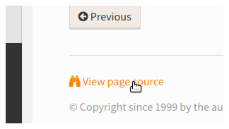

.. include:: ../Includes.txt
.. highlight:: rst

.. _writing-rest-introdction:
.. _writing-rest-introduction:

============
Introduction
============

reST
====

The official documentation for TYPO3 uses reStructuredText (reST). The
file ending of reST files is :file:`.rst`.

reStructuredText is a markup language for writing documentation. You can
edit the source files using plain text and add reST markup where needed.

For example to create section headers, you use underlines::

   ========
   Header 1
   ========

   Header 1.1
   ==========

   some text

   Header 1.1.1
   ------------

   some more text

   Header 1.2
   ==========

This will create a header "Header 1" on level 1 and headers "Header 1.1"
and "Header 1.2" on level 2 etc. The header level should reflect the structure
of the content.

.. code-block:: none

   Header 1
   |-> Header 1.1
       |-> Header 1.1.1
   |-> Header 1.2

On the page you are looking at now, "Introduction" is a level 1 header and "reST",
"Sphinx" etc. are level 2 headers.

The levels determine how the headers will be styled and also how they will be structured
in the menu in the sidepanel.

Sphinx
======

While reST is the markdown language, Sphinx is a suite of tools used to render the documentation.
Rendering in this context means that an output format such as PDF or HTML is created from the source .rst files.

We will not go into the exact definition here. For now, all you need to know
is that some of the markup you will be using is added on by Sphinx.
This is the case for some additional directives such as the `:ref:` directives
used for cross-referencing or the `toctree`.

Additional information: `Sphinx Markup Constructs <http://www.sphinx-doc.org/en/stable/markup/index.html>`__

Rendering
=========

The documentation source files will later be rendered into the output format (HTML) on our
documentation server. The rendering is done automatically: If the
source files change, they are rerendered.

Our headline example from above will look like this:

.. image:: ../images/rendered-headers.png
   :class: with-shadow

Looking at the source
=====================

Whenever you come across a documentation page on docs.typo3.org, you can look
at the source code by clicking on the "View page Source" link in the footer.

That way, you can see how it is done and compare the reST source with the
rendered version.

.. hint::

   Look at the source code of this page now.

